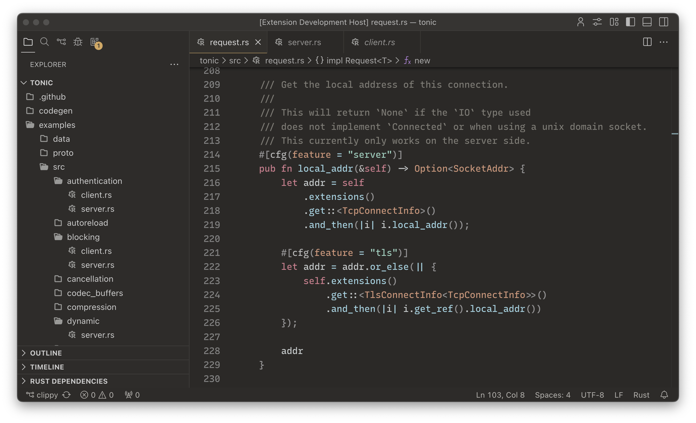

    

<h2 align="center">
    Arrakis theme for <a href="https://code.visualstudio.com/">Visual Studio Code</a>
</h2>

Harmonic and flow inducing color scheme which is gentle for your eyes.

### 📦 Installation

1. Open `extensions` tab and install `Arrakis Theme` in module.
2. Choose color scheme variant in `Preferences: Color theme`.

### Gallery
#### `01` Arrakis Night

    

    

#### `02` Arrakis Day

    

    

### Credits

- [White Sand](https://github.com/mswift42/intellij-ui-themes) Arrakis Day design is based on its color scheme.
- [Paper Owl](https://github.com/third774/paper-owl) was used as technical basis for the light theme.
